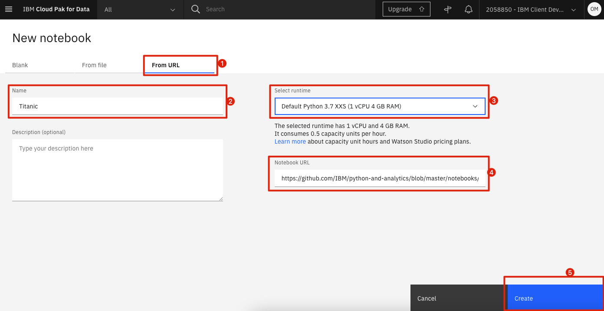

# Heart Disease Prediction Competition

This is the last part of our journey to data and AI. In this module we will put everything we have learned so far to use by creating a predictor which determines whether a patient has a heart disease.

To help you get started, we have put together a notebook that performs the basics update the science and trends a simple machine learning models for you.

Your task is to improve each section of this notebook, thus improving the accuracy of your final model. The more accurate your models predictions are on unseen data, the better your model is performing.

Remember: Your best tool to figure out how to perform the idea you have in mind is a simple online search.

## Load and Run a Notebook

* In your project, click `Add to project` and choose `Notebook`:


* Choose New notebook `From URL`. Give your notebook a name, select the smallest runtime, copy the following URL, and click `Create. 
```
https://github.com/IBM/python-and-analytics/blob/workshop-feb-2021/notebooks/heart-disease-competition.ipynb
```



Spend some time looking through the sections of the notebook to get an overview. A notebook is composed of text (markdown or heading) cells and code cells. The markdown cells provide comments on what the code is designed to do.

You will run cells individually by highlighting each cell, then either click the `Run` button at the top of the notebook or hitting the keyboard short cut to run the cell (Shift + Enter but can vary based on platform). While the cell is running, an asterisk (`[*]`) will show up to the left of the cell. When that cell has finished executing a sequential number will show up (i.e. `[17]`).

## Submission

In order to submit your results, you will fill in the last sell of this notebook which includes your name, email address, and your models accuracy which you wish to submit. 

Once you have submitted your notebook, we will review your notebook and score your model by using it to predict the heart disease of patients in a new dataset. The accuracy of your model to correctly predict whether those new patients had heart disease is used to determine your ranking.

A few notes:
- Each participant can submit as many notebooks as they wish, we will, however, consider only the best of your last three submissions.
- The submission window closes on the morning of March 24th.
- Make sure to include your name and email so we can identify you.
- Make sure to keep the format of the last cell as is and only replace your new model in it.
- If you have any issues (for example if you run out of compute power), please contact us. 