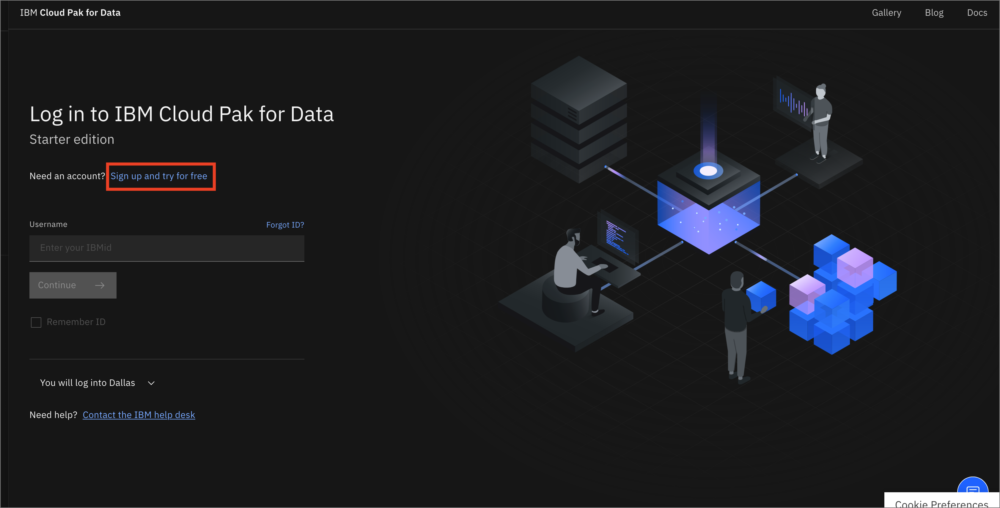
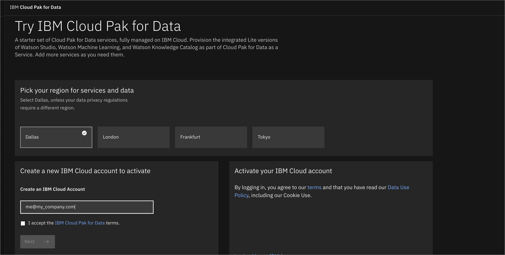
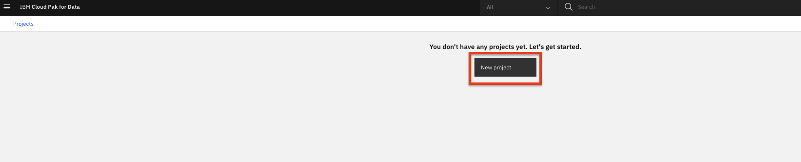
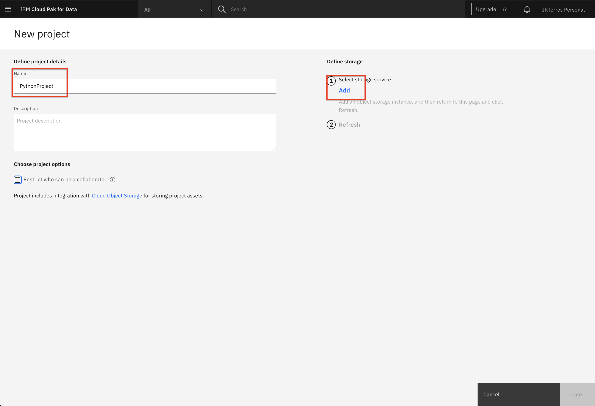

# Project setup

This part of the workshop is to provide basic setup for your project on Cloud Pak for Data as a Service.

1. [Sign up for IBM Cloud Pak for Data as a service](#1-sign-up-for-ibm-cloud-pak-for-data-as-a-service)
1. [Project setup](#2-project-setup)

## 1. Sign up for IBM Cloud Pak for Data as a service

* If you don't already have an IBM Cloud account, [sign up for IBM Cloud](https://dataplatform.cloud.ibm.com):

* Pick the region nearest to you and create your account:

## 2. Project setup

* Once you are on [Cloud Pak for Data as a Service](https://dataplatform.cloud.ibm.com) click on the left top corner (☰) hamburger menu and select `Projects`:

* Click the tile for `New project`:

* Click on `Create an empty project`:

* Give your project a name and optional description. Choose an existing Cloud Object Store or create one if needed, then click `Create`:

