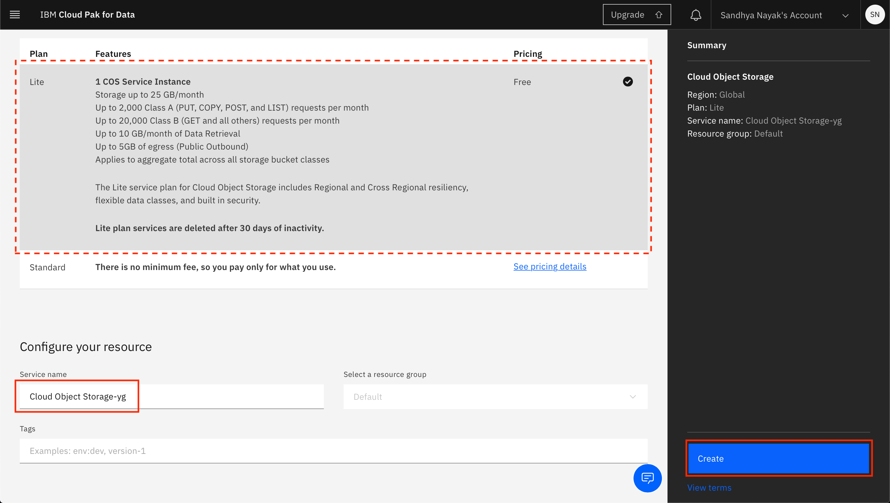

# Project setup

This part of the workshop is to provide basic setup for your project on Cloud Pak for Data as a Service.

- [Project setup](#project-setup)
  - [1. Sign up for IBM Cloud Pak for Data as a service](#1-sign-up-for-ibm-cloud-pak-for-data-as-a-service)
  - [2. Project setup](#2-project-setup)
- [FAQ](#faq)

## 1. Sign up for IBM Cloud Pak for Data as a service

* Launch a web browser and navigate to [IBM Cloud Pak for Data](https://dataplatform.cloud.ibm.com/registration/stepone?context=cpdaas&apps=all&preselect_region=true)

* You can leave the pre-selected region or select the region nearest to you.

* You can then log in using your IBMid if you have one or create a new IBMid.

  * If you do not have an IBMid, enter your email address and accept the terms checkbox in the `Create a new IBM Cloud Account` section. Then click the `Next` button to complete the process of creating a new account.
  * If you are a returning user, click on the `Log in with your IBMid` link.
    > **Note:** If you are a returning user and you have watson services in a different region than the pre-selected one, you will see an error message telling you to select that region instead. See the [FAQ](../faq/README.md) section for help.

* The services required for IBM Cloud Pak for Data will be automatically provisioned for you. Once you see a message that says that the apps are ready to use, click on `Go to IBM Cloud Pak for Data`.

## 2. Project setup

In Cloud Pak for Data, we use the concept of a project to collect / organize the resources used to achieve a particular goal (resources to build a solution to a problem). Your project resources can include data, collaborators, and analytic assets like notebooks and models, etc.

* Once you are on [Cloud Pak for Data as a Service](https://dataplatform.cloud.ibm.com). Click on the (☰) navigation menu on the top left, expand *Projects* and click on the *View all projects* link.

* Click on the `New project` button on the top. *Note: If you already have existing projects, your screen will look different from the screenshot below. In that case, click on the `New project +` button on the top right.*

* Click on `Create an empty project`:

* Give the project a name and optional description. You also need to provide an object storage instance for this project. If you have not previously created a Cloud Object Storage instance in your IBM Cloud account, you can create one now by clicking `Add`. *Note: If you do have an existing storage service, select it from the drop down list and click the `Create` button.*

* A new tab opens up, where you can create the Cloud Object Service. By default, a `Lite` (Free) plan will be selected. Scroll down and update the name of your Cloud Object Storage service if you wish, and click `Create`.

* The browser tab will automatically close when the Cloud Object Storage instance has been created. Back on IBM Cloud Pak for Data as a Service, click `Refresh`.

* The newly created Cloud Object Storage instance will now be displayed under "Storage". Click `Create` to finish creating the project.

* Once the project is succesfully created you will be brought to the project overview page (*Note:You may be presented with a project tour pop up window, go ahead and close it*)

# FAQ
 
**Q1: I don't have all the services needed.**

A: In some rare cases, the services may not automatically provision for you. You can do that manually by following these instructions:

* Go the (☰) navigation menu on the top left corner of the Cloud Pak for Data UI. Expand *Services* and then click on `Service instances`.

* If you do not have an instance of *Watson Machine Learning*, or any service that you need, click on the `Add service +` button.

* Search or scroll until you find the tile for *Machine Learning*,or whichever service you need, and click on it.

* Choose the same region as you chose for your Cloud Pak for Data as a Service platform, select the *Free* tier unless your organization has already used their 1 free tier, change the name and add tags if you like. The *Default* resource group should be correct, and then click `Create`.

**Q2: I get the `That email address is already registered to an IBM Cloud account.` messsage.**

A: You must already have an IBMid account. Follow the login link provided in the error message to login to your existing account. 

**Q3: I get the `Your Watson Studio, Watson Knowledge Catalog, and Watson Machine Learning Lite services must be created in the same service region.` error.**

A: This means you have previously created some Watson services in a different region. To resolve this, go to the [CP4DaaS Login](https://dataplatform.cloud.ibm.com/registration/stepone?context=cpdaas&apps=all) page, select the region you had previously used and then login using the login link at the bottom right. Alternatively, you can create a new account and proceed as a new user to follow along.

## Conclusion

At this point we are done with this section. We have completed creating an IBM Cloud account, a Cloud Pak for Data as a Service instance, and the project that we will use in the rest of this workshop.
