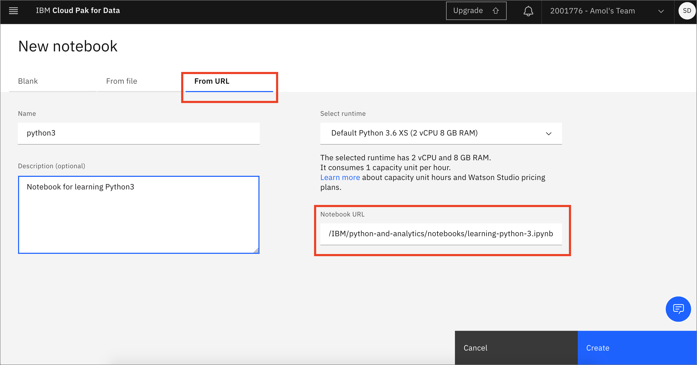

# Learning Python3

You might think that **Python** is only for developers and people with computer science degrees. However, Python is great for beginners, even those with little coding experience because it’s free, open source, and runs on any platform. The Python packages documentation is great, and after an [introductory course](https://cognitiveclass.ai/learn/data-science-with-python), you have a good foundation to build on.

Python is a general purpose and high-level programming language that is used for more than working with data. For example, it’s good for developing desktop GUI applications, websites, and web applications. However, this tutorial focuses on the data and only goes through getting started with data.

## Getting Started with Jupyter Notebooks

Instead of writing code in a text file and then running the code with a Python command in the terminal, you can do all of your data analysis in one place. Code, output, tables, and charts can all be edited and viewed in one window in any web browser with [Jupyter Notebooks](https://jupyter.org/). As the name suggests, this is a notebook to keep all of your ideas and data explorations in one place. In this tutorial, you use [IBM Watson Studio](https://dataplatform.cloud.ibm.com/docs/content/wsj/getting-started/overview-ws.html) to run a notebook. For this, you need a free IBM Cloud account. The following steps show you how sign up and get started. When you have the notebook up and running, you can go through the notebook.

Jupyter notebooks are an open-source web application that allows you to create and share documents that contain live code, equations, visualizations and explanatory text.

In this workshop we will use IBM Watson Studio to run a notebook. For this you will need an IBM Cloud account. The following steps will show you how sign up and get started. When you have the notebook up and running we will go through the notebook.

If you have not already done so, make sure that you do the work for your [project setup](../project-setup/README.md)

## Load and Run a Notebook

* In your project, click `Add to project` and choose `Notebook`:

* Choose New notebook `From URL`. Give your notebook a name and copy the URL `https://github.com/IBM/python-and-analytics/blob/master/notebooks/learning-python-3.ipynb`. Click `Create`:

Spend some time looking through the sections of the notebook to get an overview. A notebook is composed of text (markdown or heading) cells and code cells. The markdown cells provide comments on what the code is designed to do.

You will run cells individually by highlighting each cell, then either click the `Run` button at the top of the notebook or hitting the keyboard short cut to run the cell (Shift + Enter but can vary based on platform). While the cell is running, an asterisk (`[*]`) will show up to the left of the cell. When that cell has finished executing a sequential number will show up (i.e. `[17]`).
