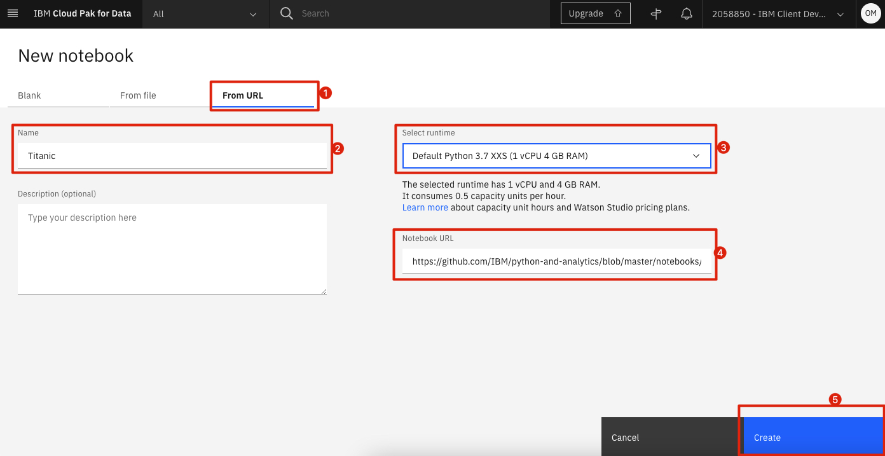

# Titanic DataScience Study

In this section, will explore a notebook that looks at the popular [Titanic dataset](https://www.openml.org/d/40945), manipulates the data, and finally creates a predictive model to predict which of the passengers will survive the disaster and which won't. 

Unlike many other notebooks that are written by the experts for the experts, this notebook is written to explore only what we need and explain each concept as they arise through our journey. So long as you have completed the previous sections, you should find this notebook easy to follow.

## Load and Run a Notebook

* In your project, click `Add to project` and choose `Notebook`:

* Choose New notebook `From URL`. Give your notebook a name and copy the URL `https://github.com/IBM/python-and-analytics/blob/master/notebooks/Titanic.ipynb`. Click `Create`:

Spend some time looking through the sections of the notebook to get an overview. A notebook is composed of text (markdown or heading) cells and code cells. The markdown cells provide comments on what the code is designed to do.

You will run cells individually by highlighting each cell, then either click the `Run` button at the top of the notebook or hitting the keyboard short cut to run the cell (Shift + Enter but can vary based on platform). While the cell is running, an asterisk (`[*]`) will show up to the left of the cell. When that cell has finished executing a sequential number will show up (i.e. `[17]`).