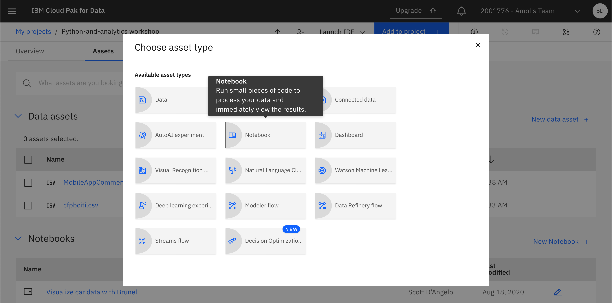
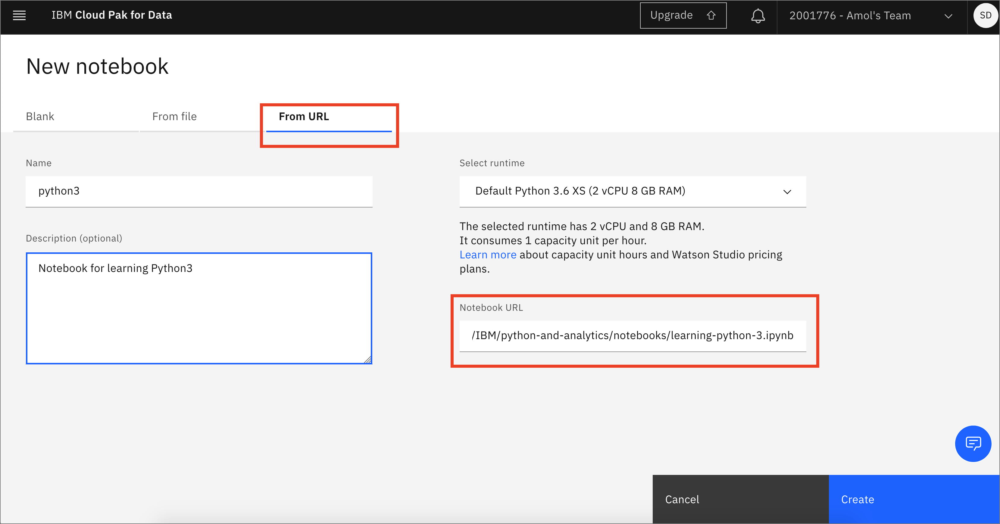

# Working with Pandas DataFrames

Pandas is a high-level data manipulation tool developed by Wes McKinney. It is built on the Numpy package and its key data structure is called the DataFrame. DataFrames allow you to store and manipulate tabular data in rows of observations and columns of variables.

In this workshop, we will learn how to:

* Create a DataFrame
* Perform operations on Rows and Columns
* Examine the data types and statistics of the features

If you have not already done so, make sure that you do the work for your [project setup](../project-setup/README.md)

## Load and Run a Notebook

* In your project, click `Add to project` and choose `Notebook`:

* Choose New notebook `From URL`. Give your notebook a name and copy the URL `https://github.com/IBM/python-and-analytics/blob/master/notebooks/work-with-data-frames.ipynb`. Click `Create`:

Spend some time looking through the sections of the notebook to get an overview. A notebook is composed of text (markdown or heading) cells and code cells. The markdown cells provide comments on what the code is designed to do.

You will run cells individually by highlighting each cell, then either click the `Run` button at the top of the notebook or hitting the keyboard short cut to run the cell (Shift + Enter but can vary based on platform). While the cell is running, an asterisk (`[*]`) will show up to the left of the cell. When that cell has finished executing a sequential number will show up (i.e. `[17]`).
