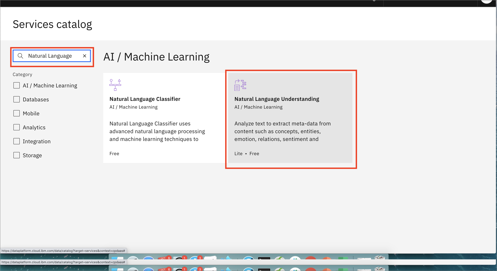
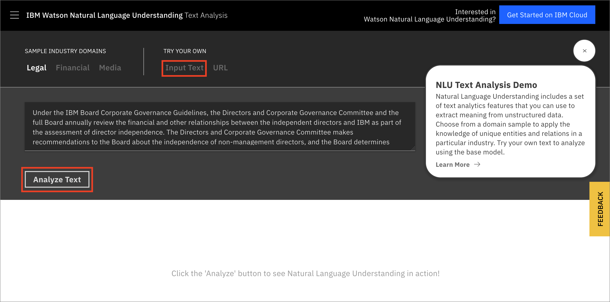
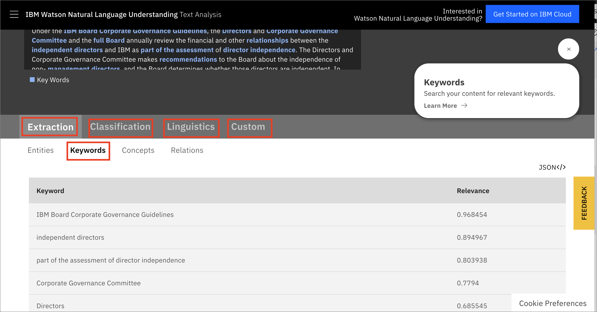
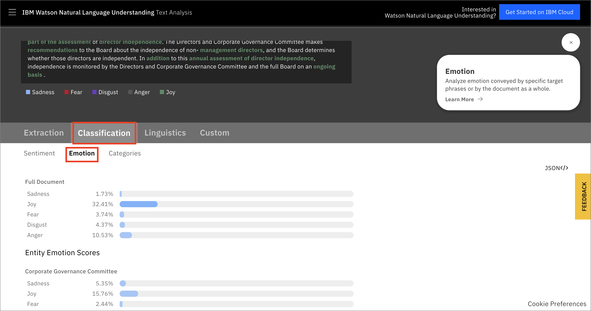
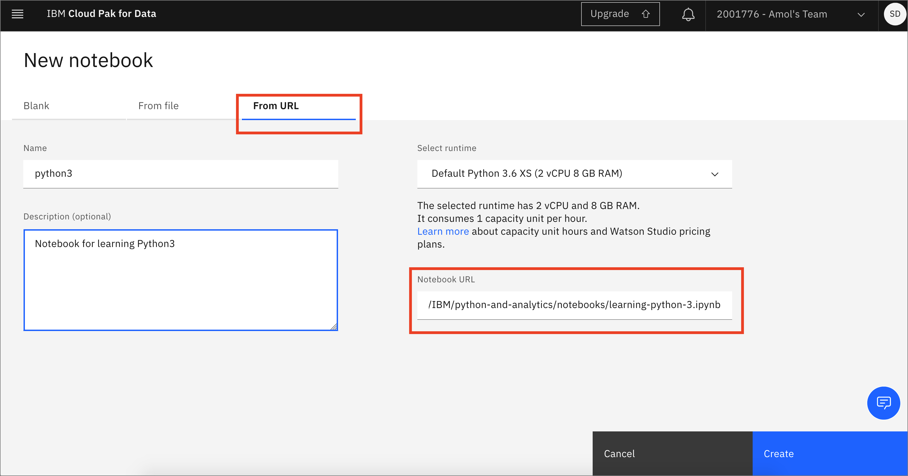

# Natural Language Understanding

Natural-language understanding (NLU) is a subtopic of natural-language processing in artificial intelligence that deals with machine reading comprehension.[1](https://en.wikipedia.org/wiki/Natural-language_understanding)
In this lab, we'll use Watson Natural Language Understanding to extract keywords from a data set and analyze them for the sentiment that is expressed. We'll do this in a Jupyter notebook using Python APIs and then we'll utilize [Pandas](https://pandas.pydata.org/pandas-docs/stable/index.html), [Matplotlib](https://matplotlib.org/index.html), and [Seaborn](https://seaborn.pydata.org/index.html) to visualize this information to aid in extracting insights. 

In this workshop, we will learn how to:

* Create and use and instance of Watson Natural Language Understanding
* Connect to Watson Natural Language Understanding using Python APIs
* Perform analysis on text to derive Keywords, Sentiment, and Emotion
* Depict our information graphicaly to better understand the data

If you have not already done so, make sure that you do the work for your [project setup](../project-setup/README.md)

## Create a Watson NLU instance

* Navigate to the [IBM Cloud Catalog](https://cloud.ibm.com/catalog#services) and in the search bar, type "Natural Language Understanding":

* Choose the free `Lite` plan (unless your organization has already provisioned 1 instance of the `Lite` plan, in which case your subsequent plans would need to be on a paid tier). Give the service a meaningful name anc click `Create`.

* In your newly created instance of NLU you will see the *API Key* and *URL* under `Credentials`.

Either keep this tab open to access the *API Key* and *URL* later, or copy them to a file now.

Note that you can access the [Getting started tutorial](https://cloud.ibm.com/docs/services/natural-language-understanding?topic=natural-language-understanding-getting-started#getting-started-tutorial) and the [API reference](https://cloud.ibm.com/apidocs/natural-language-understanding) from here. You may wish to look at these for a more in-depth investigation of Watson Natural Language Understanding.

## Demonstration of Watson NLU and Sentiment Analysis

* Visit the [Live Demo of Watson Natural Language Understanding](https://www.ibm.com/demos/live/natural-language-understanding/self-service/home). Click the `Analyze text` button.

* Click on the tabs for `Extraction`, `Classification`, `Linguistics`, and the `Custom` Entities. Notice that there are sub-tabs for each that you can investigate.

* Click on the tab for `Classification` and the sub-tab `Emotion`. You can see how NLU extracts information about the emotional content of the text.

Here you can see the confidence scores for each of the various target phrases that were extracted, broken down into "Sadness", "Joy", "Fear", "Disgust", and "Anger".

Now that we've seen how Natural Language Understanding and Sentiment Analysis work, let's use the [Python APIs](https://cloud.ibm.com/apidocs/natural-language-understanding?code=python) in a Jupyter notebook along with our graphing and visualization tools.

## Load and Run a Notebook

* Go to your project on [Cloud Pak for Data as a Service](dataplatform.ibm.com)

* In your project, click `Add to project` and choose `Notebook`:

* Choose New notebook `From URL`. Give your notebook a name and copy the URL `https://github.com/IBM/python-and-analytics/blob/master/notebooks/nlu-sentiment-analysis.ipynb`. Click `Create`:

Spend some time looking through the sections of the notebook to get an overview. A notebook is composed of text (markdown or heading) cells and code cells. The markdown cells provide comments on what the code is designed to do.

You will run cells individually by highlighting each cell, then either click the `Run` button at the top of the notebook or hitting the keyboard short cut to run the cell (Shift + Enter but can vary based on platform). While the cell is running, an asterisk (`[*]`) will show up to the left of the cell. When that cell has finished executing a sequential number will show up (i.e. `[17]`).
