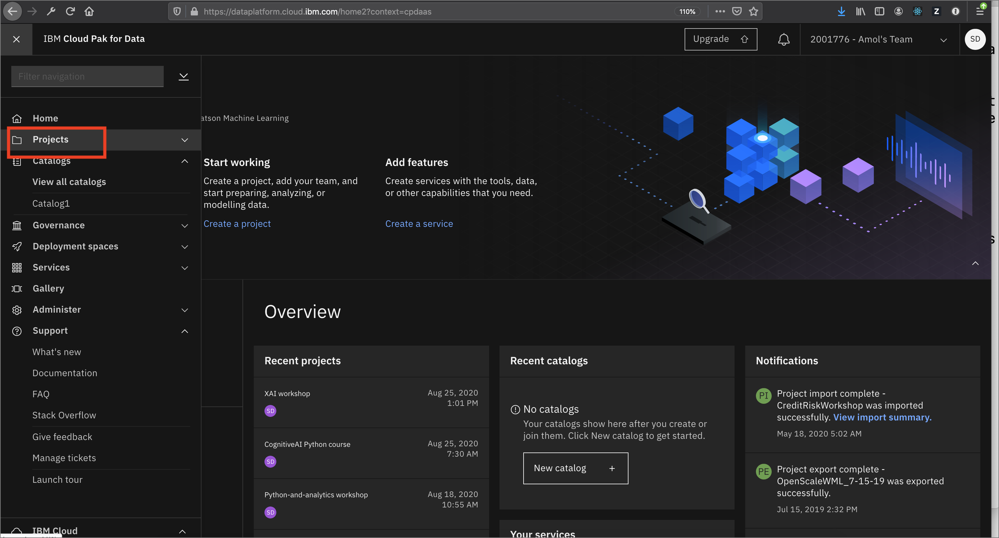

# Project setup

This part of the workshop is to provide basic setup for your project on Cloud Pak for Data as a Service.

1. [Sign up for IBM Cloud Pak for Data as a service](#1-sign-up-for-ibm-cloud-pak-for-data-as-a-service)
1. [Project setup](#2-project-setup)
1. [Download or Clone the Repository](#3-download-or-clone-the-repository)

## 1. Sign up for IBM Cloud Pak for Data as a service

* If you don't already have an IBM Cloud account, [sign up for IBM Cloud](https://dataplatform.cloud.ibm.com):


* Pick the region nearest to you and create your account:


## 2. Project setup

* Once you are on [Cloud Pak for Data as a Service](https://dataplatform.cloud.ibm.com) click on the left top corner (☰) hamburger menu and select `Projects`:



* Click the tile for `New project`:


* Click on `Create an empty project`:


* Give your project a name and optional description. Choose an existing Cloud Object Store or create one if needed, then click `Create`:


## 3. Download or Clone the Repository

Various parts of this workshop will require the attendee to upload files or run scripts that we've stored in the repository. So let's get that done early on, you'll need [`git`](https://git-scm.com) on your laptop to clone the repository directly, or access to [GitHub.com](https://github.com/) to download the zip file.

* To Download, go to the [GitHub repo for this workshop](https://github.com/IBM/python-and-analytics) and download the archived version of the workshop and extract it on your laptop.


* Alternately, run the following command:

```bash
git clone https://github.com/IBM/python-and-analytics.git
cd python-and-analytics
```

